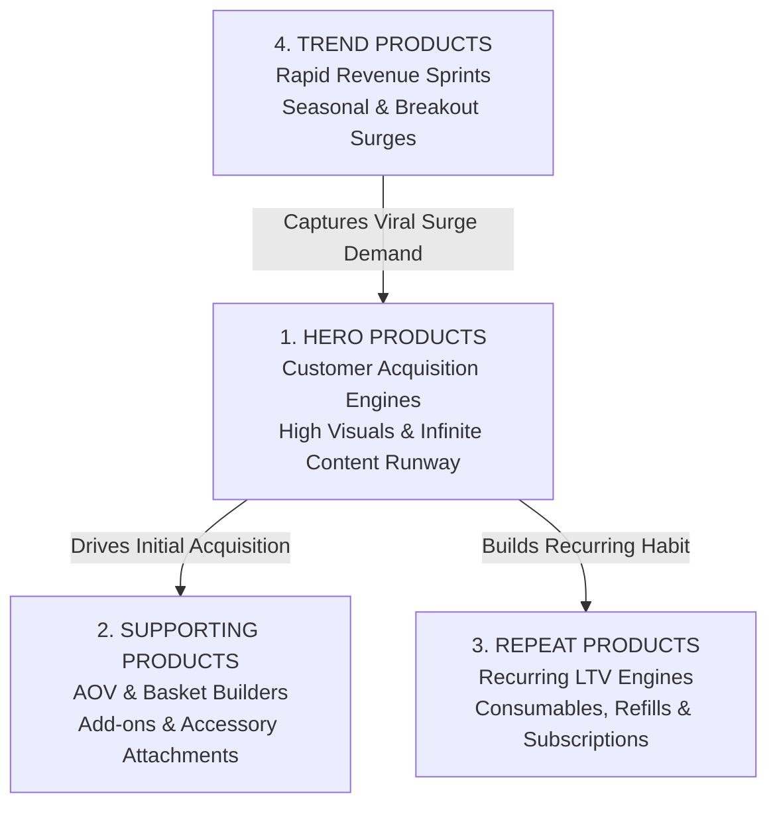

# TikTok Commerce — Multi-Agent System Architecture

> **Mission**: Build, launch, operate, and continuously optimize a content-led, high-converting TikTok Shop ecommerce brand. Every product is vetted through a rigorous 100-point rubric, and every post delivers genuine emotional and entertainment value.

---

## The 5 Specialist AI Agents

| # | Agent Name | Codename | Core Focus | Primary KPI |
|---|------------|----------|------------|-------------|
| **1** | **Product & Market Intelligence** | `MarketIntel` | 100-Point Product Scorecard, 4-Tier Catalog Strategy (Hero, Supporting, Repeat, Trend), Market Research | Product Score /100, Gross Margin Potential, Viability Index |
| **2** | **Brand & Creative Director** | `HookMaster` | 3s Hooks, Narrative Scripts, 9 Emotion Pillars, Video Retention Pacing | Average Watch Time, Share Rate, In-Video CTR |
| **3** | **Shop Merchandiser & Strategist** | `ShopEngine` | Catalog, Unit Economics, Bundles, TikTok Shop Compliance & Health | Conversion Rate (CVR), Gross Margin %, Shop Health Score |
| **4** | **Creator, Affiliate & UGC Scaler** | `CreatorScale` | Targeted Creator Outreach, Sample Seeding, 3-Tier Collabs | Active Affiliates, Creator GMV, Sample ROI |
| **5** | **Spark Ads & Retention Optimizer** | `GrowthPulse` / `RetentionLoop` | Spark Ads Triage, Comment-to-Video Replies, VIP Reviews & LTV | Blended MER, Direct ROAS, 5-Star Review % |

---

## The 100-Point Product Scorecard Rubric

```
1. TikTok Visual Potential           — 15 pts
2. Problem / Benefit Clarity         — 15 pts
3. Emotional Appeal (9 Pillars)      — 10 pts
4. Demonstration Potential & ASMR    — 10 pts
5. Content Possibilities & Longevity — 10 pts
6. Gross Margin Potential (>= 75%)   — 10 pts
7. Impulse Purchase ($15 - $45)      — 10 pts
8. Competitive Intensity             —  5 pts
9. Shipping Simplicity (< 400g)      —  5 pts
10. Return Risk (Low defects)        —  5 pts
11. Repeat Purchase Potential        —  5 pts
─────────────────────────────────────────────
TOTAL PRODUCT SCORE                 — 100 pts
```

---

## The 4-Tier Product Strategy



---

## Directory Structure

- [`agent_1_product_intelligence.md`](file:///Users/karl/.gemini/antigravity-ide/Movie/agents/agent_1_product_intelligence.md) — Product & Market Intelligence Specialist
- [`agent_2_shopengine.md`](file:///Users/karl/.gemini/antigravity-ide/Movie/agents/agent_2_shopengine.md) — TikTok Shop Merchandiser & Product Strategist
- [`agent_3_creatorscale.md`](file:///Users/karl/.gemini/antigravity-ide/Movie/agents/agent_3_creatorscale.md) — Creator, Affiliate & UGC Scaler
- [`agent_4_growthpulse.md`](file:///Users/karl/.gemini/antigravity-ide/Movie/agents/agent_4_growthpulse.md) — Performance Marketing & Spark Ads Optimizer
- [`agent_5_retentionloop.md`](file:///Users/karl/.gemini/antigravity-ide/Movie/agents/agent_5_retentionloop.md) — Customer Experience, Retention & Community Lead
- [`team_orchestrator.md`](file:///Users/karl/.gemini/antigravity-ide/Movie/agents/team_orchestrator.md) — Team Lead & Workflow Coordinator
- [`sop_commercial_flywheel.md`](file:///Users/karl/.gemini/antigravity-ide/Movie/agents/sop_commercial_flywheel.md) — End-to-End Flywheel Standard Operating Procedures
- [`vault_product_opportunities.md`](file:///Users/karl/.gemini/antigravity-ide/Movie/agents/vault_product_opportunities.md) — 100-Point Scored Product Shortlist Dossier
- [`vault_viral_hooks.md`](file:///Users/karl/.gemini/antigravity-ide/Movie/agents/vault_viral_hooks.md) — 50+ Categorized Viral Hooks & Framing
- [`vault_creator_outreach.md`](file:///Users/karl/.gemini/antigravity-ide/Movie/agents/vault_creator_outreach.md) — Direct Message, Email, and Creator Brief Templates
