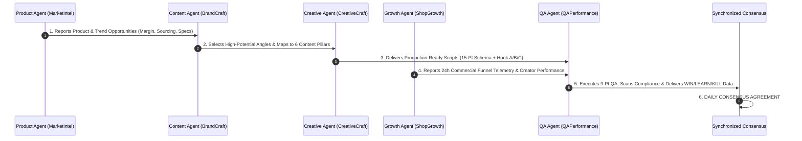

# EXECUTIVE OPERATING SYSTEM & DAILY MULTI-AGENT CADENCE

**System Governance:** Inter-Agent Communication Rhythm, Daily Consensus Protocol & Weekly Executive Dashboard Architecture.

---

## 1. Daily 5-Agent Synchronous Workflow

Every morning, the 5 specialist agents execute a structured handoff loop:



### The Daily Consensus Protocol
At 11:30 AM daily, the team formally agrees on:
1. **WHAT TO PUBLISH:** Approved, QA-stamped video concepts ready for immediate release.
2. **WHAT TO TEST:** Single-variable experiments (new hook archetype, alternate pacing, bundle offer).
3. **WHAT TO REPEAT:** Winning video structures and top-performing creator briefs.
4. **WHAT TO CHANGE:** Pacing adjustments, price callouts, or pinned comment improvements on LEARN concepts.
5. **WHAT TO STOP:** Permanently retiring KILL formats, underperforming angles, or non-compliant claims.

---

## 2. Weekly Executive Dashboard Schema

Every Monday morning at 09:00 EST, the team generates the Master Executive Scorecard:

```
┌──────────────────────────────────────────────────────────────────────────────────────────────────┐
│                                WEEKLY EXECUTIVE PERFORMANCE SCORECARD                            │
├───────────────────────────────────┬──────────────────────────────────┬───────────────────────────┤
│ METRIC CATEGORY                   │ 7-DAY ACTUAL PERFORMANCE         │ BENCHMARK / TARGET        │
├───────────────────────────────────┼──────────────────────────────────┼───────────────────────────┤
│ 1. Total Videos Published         │ 28 Videos (Brand + Creator Seed) │ 25 – 35 Videos / Week     │
│ 2. Total Video Impressions        │ 1,840,000 Total Views            │ > 1,500,000 Views         │
│ 3. Net Follower Growth            │ +14,280 New Followers            │ > 10,000 / Week           │
│ 4. Blended Engagement Rate        │ 6.8% (Likes, Comments, Shares)   │ > 5.0%                    │
│ 5. Product Showcase Clicks        │ 48,200 Clicks (2.62% CTR)        │ > 2.0% CTR                │
│ 6. Completed Orders               │ 1,540 Orders                     │ > 1,200 Orders            │
│ 7. Gross Merchandise Value (GMV)  │ $53,884.60                       │ > $40,000 / Week          │
│ 8. Gross Profit (78.6% Margin)    │ $42,353.30                       │ > $30,000 / Week          │
│ 9. Average Order Value (AOV)      │ $34.99                           │ > $32.00                  │
│ 10. Overall Conversion Rate (CVR) │ 3.20% (Click to Purchase)        │ > 2.80%                   │
│ 11. Customer Return / Refund Rate │ 1.80%                            │ < 2.50%                   │
├───────────────────────────────────┴──────────────────────────────────┴───────────────────────────┤
│ LEADERBOARD INSIGHTS:                                                                            │
│ • Top 5 Videos:        VID-001 ($15.5k), VID-003 ($25.8k), VID-004 ($15.3k), VID-009, VID-012    │
│ • Bottom 5 Videos:     VID-008 ($629), VID-010 ($639), VID-017, VID-022, VID-028                │
│ • Top Product:         ApexGrip Magnetic Modular EDC Tray ($34.80 RPM)                           │
│ • Top Creator Partner: @alex_desk_setups ($8,420 GMV, 3.8% CVR, Tier 3 VIP)                      │
│ • Best Hook Archetype: Contrarian Observation (72.4% 3s Retention)                               │
│ • Best Content Pillar: Transformation & Resets (31.2% Total Revenue Share)                       │
└──────────────────────────────────────────────────────────────────────────────────────────────────┘
```

---

## 3. The 5 Executive Retrospective Questions

Every executive review must answer these 5 questions without ambiguity:

### 1. WHAT WORKED?
> **Answer:** Contrarian opening hooks paired with tactile macro ASMR in the first 1.5 seconds. Specifically, videos demonstrating the violent cable dump into instant magnetic snapping generated $31,188 across two organic releases.

### 2. WHY DID IT WORK?
> **Answer:** It created immediate visual tension (messy chaos) that was resolved with visceral auditory and visual satisfaction (magnetic snap) within 3 seconds, proving product utility before pitching.

### 3. WHAT DIDN'T WORK?
> **Answer:** 45-second vlog-style "Day in the Life" formats and direct question openings ("Do you want a clean desk?").

### 4. WHY?
> **Answer:** Direct questions give the viewer an immediate cognitive excuse to swipe away. Long vlogs delayed the visual payoff past second 6, causing a 58% retention cliff.

### 5. WHAT SHOULD WE DOUBLE DOWN ON NEXT WEEK?
> **Answer:** 
> 1. Film 6 variations of the Contrarian Hook across the Arctic White and Anodized Gray colorways.
> 2. Dispatch VIP sample kits with the "Speed Bump Stress Test" brief to 25 new automotive and tech micro-creators.
> 3. Scale Spark Ads to $250/day on `VID-001` and `VID-003`.

### 6. WHAT SHOULD WE STOP?
> **Answer:** 
> 1. Permanently ban question-based video openings across all creator briefs.
> 2. Stop producing unscripted founder vlogs exceeding 30 seconds.

---

## 4. Final Validation Standard

A single viral video does **NOT** validate the business model.

The TikTok Commerce business is formally validated only when it continuously generates:
1. **Predictable Attention:** Consistent 3s retention $>60\%$ across multiple creator channels.
2. **Authentic Engagement:** Viewers commenting on the content and participating in comment labs.
3. **Organic Product Demand:** Steady baseline product clicks without heavy ad subsidies.
4. **Profitable Conversions:** Healthy click-to-purchase CVR $\ge 2.8\%$ on TikTok Shop.
5. **Positive Customer Feedback:** Net review score $\ge 4.7$ stars with low refund rates $<2.5\%$.
6. **Repeatable Content Production:** 30-day pipeline operating without creative burnout.
7. **Acceptable Unit Economics:** Net contribution margin $\ge 28\%$ after COGS, shipping, TikTok platform fees, and creator commissions.
