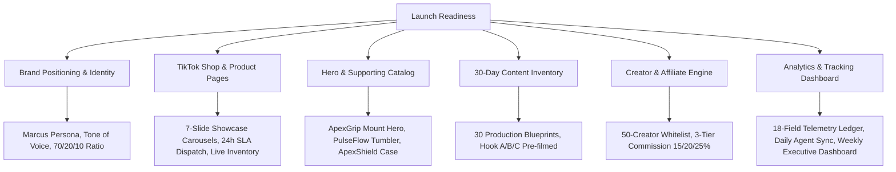
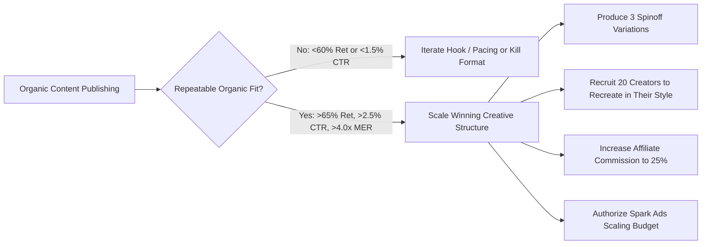

# TIKTOK COMMERCE: LAUNCH, TESTING & SCALING PLAYBOOK

**System Standard:** Operational Playbook for Launch Readiness, Single-Variable Testing & Brand Integrity Standards.

---

## 1. Launch Phase Readiness Protocol

Do not launch the TikTok account with random, un-sequenced content. The launch sequence requires complete asset pre-flight:

### Launch Checklist Matrix



### Pre-Launch Asset Inventory
1. **Brand Positioning:** Clear answer to *"Why follow if not buying today?"* documented and agreed upon across all 5 agents.
2. **TikTok Shop Infrastructure:** Active seller account, verified payment gateway, <24h dispatch SLA guarantee, 7-slide conversion carousels.
3. **Catalog Architecture:** 1 Hero acquisition product ($78.6\%$ margin), 2 Supporting lifestyle products, and 1 Repeat consumable.
4. **Content Pipeline Inventory:** Minimum 30 production-ready video concepts with Hook A/B/C scripts to ensure zero cadence gaps.
5. **Creator Seed Roster:** 50 micro-creators (10k–100k followers) identified with personalized DM pitches and sample kits queued.
6. **Analytics Telemetry:** 18-point database configured to log every impression, retention curve, CTR, and cart checkout.

---

## 2. Systematic Single-Variable Testing Phase

Never test multiple variables simultaneously. Isolate single levers to establish clear causality.

```
┌──────────────────────────────────────────────────────────────────────────────────────────────────┐
│                             SYSTEMATIC SINGLE-VARIABLE TEST MATRIX                               │
├──────────────────────┬──────────────────────────────────────────┬────────────────────────────────┤
│ TEST DIMENSION       │ VARIABLE A (Control)                     │ VARIABLE B (Challenger)        │
├──────────────────────┼──────────────────────────────────────────┼────────────────────────────────┤
│ 1. Hook Archetype    │ Contrarian Observation                   │ Extreme Drop / Stress Test     │
│ 2. Video Length      │ 18 – 24 Seconds (Fast Pacing)            │ 35 – 45 Seconds (Deep Tutorial)│
│ 3. Content Pillar    │ Desk Setup Transformation (Reset)        │ Myth Busting / Education       │
│ 4. Product Angle     │ Ergonomic Pain Relief                    │ Minimalist Aesthetic Workflow  │
│ 5. Pricing & Offer   │ $34.99 + $4.99 Shipping                  │ $39.99 with Free Shipping      │
│ 6. Bundle Tier       │ Standalone Hero Unit                     │ "Buy 2 Save 20%" Bundle        │
│ 7. Call-to-Action    │ "Tap the yellow basket below"            │ "Batch 2 shipping in cart 👇"  │
│ 8. Creator Type      │ Tech Reviewer / Desk Setup Niche         │ Productivity / Remote Worker   │
│ 9. Style Formats     │ Raw POV ASMR                             │ Talking Head + B-Roll Cutaways │
└──────────────────────┴──────────────────────────────────────────┴────────────────────────────────┘
```

### The Golden Single-Variable Rule
> **Only change one major variable per test cohort.**  
> If you change the hook, video duration, and pricing at the same time, it is impossible to know which change drove the performance delta.

---

## 3. Scaling Rules (Organic Validation First)



### Core Scaling Constraints
1. **Never use paid ads to rescue content nobody wants to watch organically.** Paid advertising is an amplifier of organic traction, not a cure for boring content.
2. **Creative Structure Replication:** When a format wins, extract its structural anatomy (Hook timing $\rightarrow$ Tension reveal $\rightarrow$ Tactile demonstration $\rightarrow$ CTA) and film across adjacent SKUs.
3. **Affiliate Distribution Multiplier:** Hand winning script structures to vetted micro-creators to reproduce organically with their own audience.

---

## 4. Brand Integrity & Anti-Gimmick Rulebook

**Never sacrifice long-term brand credibility for short-term TikTok revenue.**

### 🚫 Non-Negotiable Prohibitions

| Banned Practice | Why It Destroys the Brand | Enforced Standard |
|---|---|---|
| **Fake Urgency** | Countdown timers that reset on reload; "Only 1 left in the world" when stock is full. | Real batch updates: *"Batch 1 sold out in 48h; Batch 2 is currently shipping."* |
| **Fake Reviews** | Staged AI testimonials or manufactured 5-star comments. | 100% verified TikTok Shop buyer reviews with transparent feedback addressing objections. |
| **Misleading Claims** | Claiming "cures arthritis", "100% unbreakable", or using artificial filters on product demos. | Empirical demonstration: Continuous timecode, drop tests, and lab-tested alloy specs. |
| **Spam Posting** | Flooding 10 low-effort videos a day to brute-force algorithms. | Cap at 3–5 high-production, high-value videos per day following the 70/20/10 ratio. |
| **Competitor Copying** | Word-for-word ripping of viral competitor scripts. | Original angles derived from customer comments, unique brand voice, and proprietary demonstrations. |
| **Low-Quality AI Slop** | Lifeless automated video slides with robotic text-to-speech. | High-production human demonstrations, visceral ASMR foley, and cinematic lighting. |
| **Constant Discounting** | Training the audience to only buy on 80% clearances. | Maintain premium baseline pricing with value-add bundles (Buy 2 Save 20%) rather than cheapening the brand. |
| **Clickbait Without Payoff**| Outrageous opening hooks that never resolve or relate to the product. | Every hook must deliver an authentic, satisfying payoff within the video. |

---

## 5. Long-Term Brand Equity Milestones

Customers should gradually recognize:
1. **The Content Style:** Dark obsidian aesthetics, warm side lamps, crisp macro ASMR, and dynamic 1.5s cuts.
2. **The Brand Personality:** Relatable, witty, empathetic, confident, and zero corporate fluff.
3. **The Product Category:** The benchmark for tactile, minimalist everyday carry and workspace tools.
4. **The Community:** The *Sunday Reset Club* and *Apex Collective*, where customers actively participate in design decisions and comment labs.
