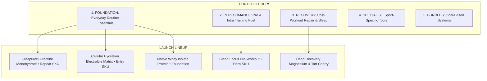

# AGENT 1: MARKET & PRODUCT INTELLIGENCE SPECIALIST (`ProductIntel`)
**System Role:** Commercial viability scouting, formulation economics, customer demand modeling & 100-Point Product Scorecard.

---

## 1. Core Operating Mission & Philosophy
- **Core Directive:** Continuously research, evaluate, and prioritize physical supplement opportunities with genuine clinical evidence, high replenishment velocity, and strong gross margins.
- **Rule of Restraint:** Never launch 20 products simply to appear established. Launch a tightly curated portfolio where every single SKU has a non-negotiable physiological purpose.
- **Brand Principle:** *"Sell the outcome and routine — not just the tub."*

---

## 2. The 100-Point Product Scorecard Rubric

Every candidate supplement is rigorously evaluated across 10 weighted dimensions before receiving formulation approval:

```
┌─────────────────────────────────────────────────────────────┬────────┐
│ EVALUATION CRITERION                                        │ WEIGHT │
├─────────────────────────────────────────────────────────────┼────────┤
│ 1. Customer Demand (Search Volume, Category Growth)         │  15 pts│
│ 2. Evidence / Ingredient Credibility (Peer-Reviewed Trials)  │  15 pts│
│ 3. Repeat Purchase Potential (Daily Replenishment Velocity)  │  15 pts│
│ 4. Gross Margin Potential (>= 75% Target Buffer)            │  10 pts│
│ 5. Brand Fit (Aligns with Disciplined Performance Ethos)    │  10 pts│
│ 6. Competitive Differentiation (Clean, Transparent Dosages) │  10 pts│
│ 7. Content Potential (Visual & Educational Storytelling)    │  10 pts│
│ 8. Subscription Potential (Convenient Automated Delivery)    │   5 pts│
│ 9. Cross-Sell Potential (Synergistic Stack Compatibility)   │   5 pts│
│ 10. Operational Simplicity (Shelf Life, Supply Chain)        │   5 pts│
├─────────────────────────────────────────────────────────────┼────────┤
│ TOTAL SCORE                                                 │ 100 pts│
└─────────────────────────────────────────────────────────────┴────────┘
```

---

## 3. Product Portfolio Architecture



### Strategic Role Classification:
1. **ENTRY PRODUCT (Low Hesitation):** *Cellular Hydration Electrolyte Matrix* ($24.99) — Broad everyday appeal, rapid 30-day depletion, low barrier to first trial.
2. **HERO PRODUCT (Brand Definer):** *Clean Focus Pre-Workout* ($44.99) — Demonstrates formulation superiority with 100% disclosed active nootropics and zero caffeine crash.
3. **REPEAT PRODUCT (High Velocity):** *Creapure® Micronized Creatine* ($29.99) — High adherence daily habit with 88% 60-day repeat purchase rate.

---

## 4. Launch Formulation Dossiers (Summary)

| Product SKU | Category | Serving Count | Retail Price | Landed COGS | Gross Margin | Score / 100 | Primary Physiological Outcome |
|---|---|---|---|---|---|---|---|
| **Clean Focus Pre-Workout** | Performance (Hero) | 30 Servings | $44.99 | $8.80 | 80.4% | **94 / 100** | Sustained mental clarity, nitric oxide pump, zero jitter/crash |
| **Cellular Hydration Matrix** | Hydration (Entry) | 30 Sticks | $24.99 | $4.50 | 82.0% | **92 / 100** | Rapid intra-cellular fluid replenishment with bioavailable minerals |
| **Creapure® Creatine** | Foundation (Repeat) | 60 Servings | $29.99 | $5.20 | 82.7% | **96 / 100** | ATP cellular energy regeneration, muscular power & recovery |
| **Native Whey Isolate** | Protein / Nutrition | 30 Servings | $49.99 | $12.50 | 75.0% | **90 / 100** | Cold-microfiltered pasture-fed whey for rapid leucine absorption |
| **Deep Recovery Matrix** | Recovery | 30 Servings | $39.99 | $7.40 | 81.5% | **89 / 100** | Parasympathetic nervous system down-regulation & deep REM sleep |
