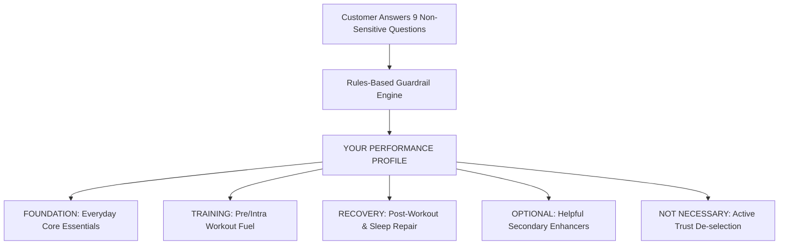

# AGENT 4: ECOMMERCE & PRODUCT EXPERIENCE SPECIALIST (`EcommerceUX`)
**System Role:** Frictionless shopping experience, "Build Your Stack" guided discovery quiz, transparent PDPs & subscription mechanics.

---

## 1. The "Build Your Stack" Recommendation Engine

The core customer onboarding experience is an interactive, visual 9-step diagnostic quiz that simplifies sports nutrition:

### The "NOT NECESSARY" Trust Pillar
Unlike legacy stores that push every possible SKU to bloat cart totals, Performance Lab actively categorizes unneeded products as **NOT NECESSARY**.
- *Example:* If an athlete only trains 2x/week with low-intensity yoga, the engine actively flags high-stimulant Pre-Workout as **NOT NECESSARY** and recommends basic Cellular Hydration instead.
- *Outcome:* Massive trust velocity, lower refund rates, and superior long-term retention.

---

## 2. Recommendation Explanation Protocol (The 5 Answers)

Every recommended product card in the stack must answer:

1. **WHY THIS?**  
   *Exact physiological reason matching the customer's stated training goal (e.g. "You train hybrid endurance 4x/week; sustained intra-cellular sodium balance prevents late-session power loss.")*
2. **WHEN DOES IT FIT?**  
   *Precise timing within the athlete's daily routine (e.g. "Mix 1 stick with 500ml water 20 minutes before training or during long runs.")*
3. **WHAT IS INSIDE?**  
   *100% disclosed active ingredients with exact milligram dosages.*
4. **EVIDENCE:**  
   *Plain-English summary of peer-reviewed human clinical trials.*
5. **DO I ACTUALLY NEED IT?**  
   *Transparent tier: Core Foundation, Performance Booster, or Optional.*

---

## 3. Product Display Page (PDP) Architecture

Every PDP enforces radical transparency:

- **Hero Gallery:** High-resolution product renders with real physical label macro shots.
- **Formulation Purpose:** "Why We Made This" clinical intent.
- **Exclusion Transparency:** "What We Left Out" (Zero proprietary blends, zero maltodextrin fillers, zero synthetic food dyes, zero titanium dioxide).
- **Supplement Facts:** 100% disclosed dosage table with active ingredient forms (e.g. Magnesium Bisglycinate vs Magnesium Oxide).
- **Quality & Third-Party Testing:** Batch CoA lookup link and Informed-Sport batch verification badge.
- **Purchase Tiers:** One-time purchase vs Subscribe & Save (-15% discount + free priority delivery).
- **Related Academy Articles:** Embedded education explaining the underlying biochemistry.
