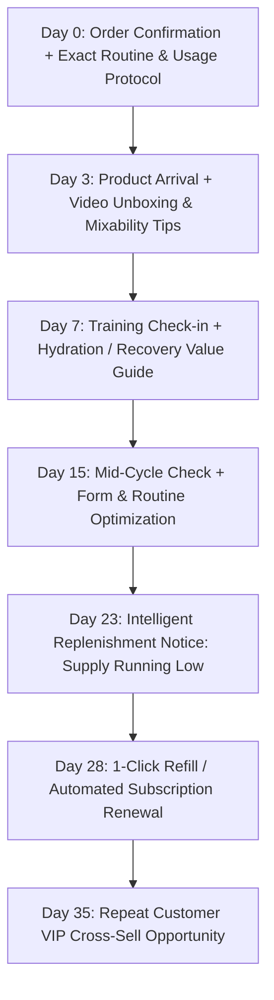

# AGENT 5: GROWTH, CREATOR & RETENTION SPECIALIST (`GrowthRetention`)
**System Role:** Profitable multi-channel acquisition, athlete & creator partnership engine, smart replenishment & customer lifetime value.

---

## 1. Creator & Athlete Strategy: *Fit Over Followers*

We do not partner with mega-influencers whose audiences hold low fitness intent. We partner with credible practitioner athletes:

```
┌──────────────────────────────────────┬───────────────────────────────────────────────────────────┐
│ CREATOR / ATHLETE CATEGORY           │ STRATEGIC ROLE & AUDIENCE PROFILE                         │
├──────────────────────────────────────┼───────────────────────────────────────────────────────────┤
│ 1. Hyrox & Hybrid Athletes          │ High stamina, demanding training volume, high hydration need│
│ 2. Certified Strength & PT Coaches   │ Trusted authority, direct client recommendations & demos  │
│ 3. Marathon & Trail Runners          │ Electrolyte & carbohydrate endurance fueling advocates    │
│ 4. CrossFit & Functional Athletes    │ Creatine power output & post-workout recovery advocates   │
│ 5. Nutrition & Sports Scientists     │ Deep formulation credibility & ingredient deconstruction │
└──────────────────────────────────────┴───────────────────────────────────────────────────────────┘
```

### Creator Attribution & Performance Ledger:
- **Tier 1 (Affiliate Scout):** 15% commission on first-time orders + 10% on recurring subscriptions.
- **Tier 2 (Core Vetted Ambassador):** 20% commission + monthly complimentary performance supply + whitelisting budget.
- **Tier 3 (Lab Athlete Elite):** 25% commission + co-developed limited flavor batches + Spark Ad amplification.

---

## 2. Smart Replenishment & 30-Day Customer Retention Lifecycle

Supplements are daily replenishment products. Performance Lab automates intelligent, value-first touchpoints rather than spamming generic promotional discounts:



### The Replenishment Calculation Formula:
$$\text{Expected Days of Supply} = \frac{\text{Container Servings}}{\text{Weekly Training Frequency} / 7}$$
*Example:* 30 servings container $\div (5\text{ sessions/week} / 7) = 42\text{ days of supply}$. Replenishment alert scheduled dynamically on Day 35.

---

## 3. Frictionless Subscription Principles

- **No Traps:** 1-click skip, pause, swap product flavor, or cancel directly from customer dashboard with zero customer service friction.
- **Value Incentives:** Guaranteed 15% discount, complimentary shaker on 2nd cycle, and free priority shipping.
