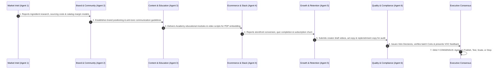

# MASTER ORCHESTRATOR: PERFORMANCE LAB OPERATING SYSTEM

**System Role:** Daily 6-Agent Synchronous Communication Cadence, Central Task List Governance & Weekly Executive Dashboard.

---

## 1. Daily 6-Agent Synchronous Operating Rhythm

Every morning, the 6 specialist agents execute an integrated handoff loop:



---

## 2. Weekly Executive Performance Dashboard

Every Monday at 08:30 EST, the system compiles the executive telemetry scorecard:

```
┌──────────────────────────────────────────────────────────────────────────────────────────────────┐
│                            PERFORMANCE LAB WEEKLY EXECUTIVE SCORECARD                            │
├───────────────────────────────────┬──────────────────────────────────┬───────────────────────────┤
│ METRIC CATEGORY                   │ 7-DAY ACTUAL PERFORMANCE         │ BENCHMARK / TARGET        │
├───────────────────────────────────┼──────────────────────────────────┼───────────────────────────┤
│ 1. Gross Revenue (GMV)            │ $68,450.00                       │ > $50,000 / Week          │
│ 2. Total Orders Completed         │ 1,180 Orders                     │ > 900 Orders              │
│ 3. Average Order Value (AOV)      │ $58.00 (Stack Bundles)           │ > $52.00                  │
│ 4. Blended Gross Margin           │ 79.4%                            │ > 75.0%                   │
│ 5. Net Contribution Margin        │ 31.8% (After Ads, COGS, Ship)    │ > 28.0%                   │
│ 6. Storefront Conversion Rate     │ 3.85% (Quiz to Purchase)         │ > 3.00%                   │
│ 7. Active Subscribers             │ 1,420 Active Accounts            │ > 1,000 Accounts          │
│ 8. Monthly Subscription Churn     │ 3.9%                             │ < 5.0%                    │
│ 9. Customer Return / Refund Rate  │ 0.8%                             │ < 1.5%                    │
│ 10. Customer Acquisition Cost     │ $22.40 (Blended)                 │ < $28.00                  │
│ 11. Customer Lifetime Value (LTV) │ $164.00 (6-Month Realized)       │ > $140.00                 │
│ 12. LTV : CAC Ratio               │ 7.32 : 1                         │ > 4.0 : 1                 │
├───────────────────────────────────┴──────────────────────────────────┴───────────────────────────┤
│ LEADERBOARD INSIGHTS:                                                                            │
│ • Best-Selling SKU:    Clean Focus Pre-Workout ($24,800 GMV)                                     │
│ • Top Goal Stack:      Hybrid Performance Stack (Hydration + Pre-Workout + Creatine)             │
│ • Top Creator Partner: Marcus Rivera (Hyrox Athlete & Coach &bull; $9,400 GMV, 4.2% CVR)         │
│ • Top Content Hook:    "Why drinking 4L of plain water can dehydrate your cells" (620k views)    │
│ • Inventory Cover:     6.2 Weeks Average across all 5 SKUs (Zero immediate stockout risk)        │
└──────────────────────────────────────────────────────────────────────────────────────────────────┘
```

---

## 3. The Monday Executive Review (P1 / P2 / P3 Action Directives)

Every review answers the core business health questions and categorizes actions by urgency:

- **P1 — Immediate (Next 24 Hours):**
  - Place reorder for *Cellular Hydration* raw mineral premix (lead time: 4 weeks, current cover: 3.8 weeks).
- **P2 — This Week (Next 3–5 Days):**
  - Expand *Hyrox Hybrid Stack* landing page with Marcus Rivera's workout protocol.
  - Approve new Lemonade flavor formulation samples submitted by Agent 1.
- **P3 — Monitor (Next 14 Days):**
  - Track mixability satisfaction ratings on Batch `PL-2026-0814-CR` following micronization upgrade.
