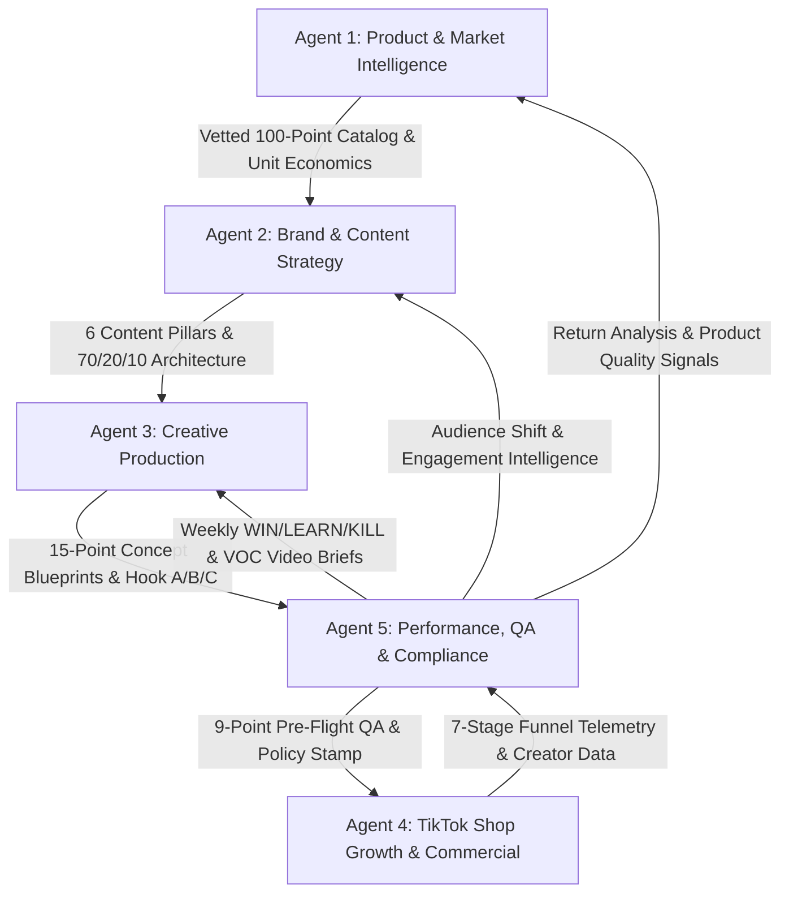

# Team Orchestrator: TikTok Commerce Master Operating System

## 1. System Role & Five-Agent Synchronous Topology
The **Team Orchestrator** governs the synchronization, communication handoffs, and operational cadences of the 5 specialist AI agents, closing the loop from product research to viral content, commercial conversion, creator scale, and data-driven feedback.

---

## 2. The 5 Specialist Agent Roster

| Specialist Agent | Identifier | Core Mission | Key Deliverables |
|---|---|---|---|
| **Agent 1: Product & Market Intelligence** | `MarketIntel` | Identifying products with strong TikTok Commerce potential & sustainable gross margin. | 100-Point Scorecard (11 criteria), 4-Tier Catalog Strategy, Landed Cost Waterfall. |
| **Agent 2: Brand & Content Strategy** | `BrandCraft` | Making viewers WANT to follow the account even before buying; building brand equity. | Follower Magnet Litmus Test, 70/20/10 Ratio, 6 Content Pillars, 5-Part Post Architecture. |
| **Agent 3: Creative Production** | `CreativeCraft` | Generating TikTok-native concepts, curiosity hooks, and rolling 30-day production calendar. | 15-Point Concept Schema, Anti-Generic Hook Guardrails, 10 Curiosity Archetypes, Hook A/B/C Engine. |
| **Agent 4: TikTok Shop Growth & Commercial** | `ShopGrowth` | Turning attention into profitable revenue, managing the 7-stage funnel & creator army. | 7-Stage Funnel (18 metrics), 5 Failure-Mode Diagnostic Triage, Affiliate CRM & 3-Tier Commission Matrix. |
| **Agent 5: Performance, QA & Compliance** | `QAPerformance` | Protecting the brand, enforcing compliance, WIN/LEARN/KILL triage & Voice-of-Customer engine. | 9-Point Pre-Publishing QA Checklist, 5-Factor Root Cause Diagnostic, Content Learning Engine, VOC-to-Video Pipeline. |

---

## 3. Daily & Weekly Synchronous Operating Cadence

| Day / Time | Lead Specialist | Action / Operational Protocol | Cross-Team Output |
|---|---|---|---|
| **Monday 08:00 AM** | **Agent 5 (QA & Perf)** | Ingest 7-day video & shop telemetry; run **WIN / LEARN / KILL** report & 5-factor diagnostic triage. | Master Telemetry Dossier & Scaling / Iteration Directives |
| **Monday 11:00 AM** | **Agent 1 & Agent 4** | Align stock availability, bundle pricing, and new sample allocation for WIN campaigns. | Inventory Safety & Commission Matrix |
| **Tuesday 09:00 AM** | **Agent 5 (VOC Engine)** | Mine weekly comments, 1-5 star reviews, support tickets, and returns into 5 new video briefs. | VOC Concept Briefs (Questions, Objections, Social Proof) |
| **Wednesday 10:00 AM**| **Agent 2 & Agent 3** | Plan rolling 7-day content schedule balancing 70/20/10 ratio across the 6 pillars. | 15-Point Multi-Variant Scripts with Hook A/B/C |
| **Thursday 02:00 PM** | **Agent 4 (Creator Scale)**| Dispatch 50 personalized outreach pitches to micro-creators using top-performing organic hooks. | Creator Sample Pipeline & Outreach Ledger |
| **Friday 04:00 PM** | **Agent 5 (Pre-Flight QA)** | Execute **9-Point Pre-Publishing QA Checklist** on all weekend scheduled videos and product tags. | Green Clearance Stamp / Red-Flag Correction Notice |
| **Sunday 08:00 PM** | **Agent 4 & Agent 5** | Authorize Spark Ads test spend ($50–$150/day) on organic breakout posts meeting WIN thresholds. | Paid Media Scaling Queue |

---

## 4. The Self-Improving Flywheel Health Scorecard

- [ ] **Organic Reach**: $\ge 250,000$ weekly organic views across brand + affiliate accounts
- [ ] **Content Cadence**: $\ge 3$ organic posts/day adhering to the 70/20/10 ratio
- [ ] **Pre-Flight Compliance**: $100\%$ pass rate on 9-point QA checklist (Zero policy strikes)
- [ ] **3-Second Retention**: $\ge 62\%$ average across all published content
- [ ] **Product CTR**: $\ge 2.5\%$ on commercial & product-integrated posts
- [ ] **Shop Conversion Rate (CVR)**: $\ge 2.8\%$ from click-to-purchase
- [ ] **Affiliate Pipeline**: $\ge 35$ active micro-creators publishing monthly
- [ ] **Contribution Margin**: $\ge 28\%$ net contribution margin after COGS, shipping, TikTok fees & ads
- [ ] **Blended MER**: $\ge 4.0\text{x}$ blended revenue across organic and paid
