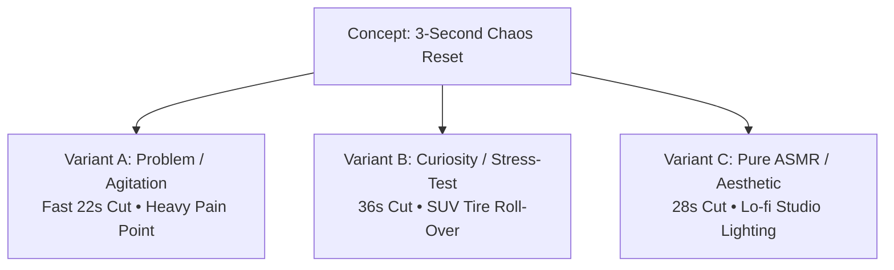

# Vault: Rolling 30-Day Content Pipeline & Multi-Variant Vault

> **Curated by Agent 3: Creative Production Specialist (`CreativeEngine`)**  
> Enforcing the **Anti-Generic Hook Rule**, **15-Point Video Concept Schema**, and **Hook A / B / C Multi-Variant Matrix**.

---

## 1. Rolling 30-Day Production Pipeline Matrix

| Day | Pillar | Ratio | Video Concept | Duration | Hook Archetype | TikTok Shop SKU Placement |
|---|---|---|---|---|---|---|
| **Day 1** | P1: Resets | 70% Value | The 60-Second Sunday Night Bag Reset | 38s | Targeted Problem | ApexGrip Modular EDC Tray (Hero) |
| **Day 2** | P2: Education | 70% Value | 3 Cable Mistakes Ruining Your Battery | 26s | Insider Regret | MagLock Cable Anchor Clips (Supporting) |
| **Day 3** | P4: Relatability | 70% Value | The 8:55 AM Zoom Meeting Panic | 22s | Relatable Frustration | ApexGrip Modular EDC Tray (Hero) |
| **Day 4** | P3: Experiments | 20% Integ. | 4,000lb SUV Tire vs Neodymium Magnet | 36s | Extreme Challenge | ApexGrip Modular EDC Tray (Hero) |
| **Day 5** | P5: Comment Lab | 20% Integ. | Replying to @Dan: "Will it hold an iPad?" | 29s | Contrarian Truth | ApexGrip Modular EDC Tray (Hero) |
| **Day 6** | P1: Resets | 70% Value | Thrifted $20 Desk to $2,000 Setup Reset | 42s | Transformation | ApexGrip + MagLock Bundle |
| **Day 7** | P6: Design BTS | 20% Integ. | Why We Scrapped 14 Prototypes Before Launch | 45s | Unexpected Results | ApexGrip Modular EDC Tray (Hero) |
| **Day 8** | P2: Education | 70% Value | The 3-Second Rule for Zero-Clutter Desks | 24s | Time-Bound Experiment | MagLock Cable Anchor Clips (Supporting) |
| **Day 9** | P4: Relatability | 70% Value | When Your TikTok Shop Order Lands Early | 20s | Relatable Frustration | ApexShield Travel Sleeve (Supporting) |
| **Day 10** | P1: Resets | 10% Commer. | Duo-Pack Launch Special & Restock Unboxing | 32s | Aspirational Outcome | Duo-Pack Launch Bundle ($54.99) |
| **Day 11** | P3: Experiments | 20% Integ. | 15-Foot Balcony Drop Test onto Concrete | 34s | Extreme Challenge | ApexGrip Modular EDC Tray (Hero) |
| **Day 12** | P5: Comment Lab | 20% Integ. | Replying to @Sarah: "Does it fit in a tote bag?" | 25s | Targeted Problem | ApexShield Travel Sleeve (Supporting) |
| **Day 13** | P2: Education | 70% Value | Cheap Plastic vs CNC Aluminum: The Real Cost | 38s | Flawed Diagnosis | ApexGrip Modular EDC Tray (Hero) |
| **Day 14** | P1: Resets | 70% Value | Saturday Morning Coffee + Desk ASMR | 30s | Aspirational Outcome | PulseFlow Nitro Tumbler (Hero) |
| **Day 15** | P6: Design BTS | 10% Commer. | Packing Order #8,419 for Weekend Rush | 28s | Viral Myth-Busting | ApexGrip Starter Kit |
| **Day 16** | P4: Relatability | 70% Value | The One Item That Cured My Bag Anxiety | 24s | Unexpected Results | ApexGrip Modular EDC Tray (Hero) |
| **Day 17** | P3: Experiments | 20% Integ. | Shaking the Tray on a High-Speed Rollercoaster | 35s | Extreme Challenge | ApexGrip Modular EDC Tray (Hero) |
| **Day 18** | P2: Education | 70% Value | How to Pack a Carry-On in 60 Seconds Flat | 40s | Insider Regret | ApexShield Silicone Sleeve (Supporting) |
| **Day 19** | P5: Comment Lab | 20% Integ. | Colorway Debate: Stealth Black vs Frost White | 26s | Community Battle | ApexGrip Colorway Variants |
| **Day 20** | P1: Resets | 70% Value | 10-Second Desk Cable Reset (Pure ASMR) | 18s | Transformation | MagLock Cable Anchor Clips (Supporting) |
| **Day 21** | P4: Relatability | 70% Value | Tell Me You Love Clean Gear Without Telling Me | 22s | Relatable Frustration | ApexGrip Modular EDC Tray (Hero) |
| **Day 22** | P3: Experiments | 20% Integ. | Submerging the Travel Sleeve in Mud & Water | 32s | Extreme Challenge | ApexShield Silicone Sleeve (Supporting) |
| **Day 23** | P2: Education | 70% Value | Why Your Desk Wires Always Get Tangled | 28s | Flawed Diagnosis | MagLock Cable Anchor Clips (Supporting) |
| **Day 24** | P6: Design BTS | 20% Integ. | How We Calibrated the Perfect Magnetic Click Sound | 35s | Unexpected Results | ApexGrip Modular EDC Tray (Hero) |
| **Day 25** | P5: Comment Lab | 20% Integ. | Replying to @Alex: "Can it hold heavy pliers?" | 24s | Contrarian Truth | ApexGrip Modular EDC Tray (Hero) |
| **Day 26** | P1: Resets | 70% Value | College Student Dorm Desk Makeover | 44s | Transformation | ApexGrip + MagLock Bundle |
| **Day 27** | P4: Relatability | 70% Value | When You Finally Fix the Wire Chaos Behind Your TV | 25s | Aspirational Outcome | MagLock Cable Anchor Clips (Supporting) |
| **Day 28** | P3: Experiments | 20% Integ. | Freezing the Neodymium Magnets in Solid Ice | 38s | Extreme Challenge | ApexGrip Modular EDC Tray (Hero) |
| **Day 29** | P2: Education | 70% Value | 3 Everyday Carry Upgrades Under $40 | 30s | Insider Regret | ApexGrip Modular EDC Tray (Hero) |
| **Day 30** | P1: Resets | 10% Commer. | Month-End Flash Sale & VIP Community Restock | 35s | Aspirational Outcome | ApexGrip Ultimate Bundle ($79.99) |

---

## 2. Deep 15-Point Multi-Variant Production Blueprints

### Production Master Blueprint 1: The ApexGrip Modular Tray

#### 1. Content Pillar: Pillar 1: Transformation & Resets (70% Value / 20% Integrated)
#### 2. Video Concept: The 3-Second Chaos-to-Flow Reset
#### 3. Target Viewer: Marcus, 26 (UX Designer / Hybrid Remote Worker)
#### 4. TikTok SEO Search Keywords: `desk organization hacks`, `EDC tray setup`, `cable management ideas`, `backpack reset`, `clean desk aesthetic`
#### 5. Suggested Caption: The before and after on this is pure visual therapy 🎒✨ Tap the cart if you need this reset! #desksetup #edc #cleantok #lifehacks
#### 6. TikTok Shop Placement: ApexGrip Modular EDC Tray (Hero SKU Anchor)
#### 7. Reason Concept Should Work: Combines instant visceral pain agitation with binaural ASMR audio gratification.

---

### Multi-Variant Creative Breakdown (Hook A / B / C Matrix)

#### 🎬 VARIANT A (Problem & Relatability Angle — 22 Seconds)
- **Opening Verbal Hook**: *"If you spend 10 minutes every morning looking for your cables, stop scrolling."*
- **First 3s Visual**: Top-down flat-lay. Frustrated hands frantically digging to the bottom of a dark chaotic backpack.
- **On-Screen Text**: `"Stop doing this every morning 🤦‍♂️"` (Center-Top, Red/White high-contrast).
- **Scene Sequence**:
  - `0:00-0:03`: Frantic digging in bag + audio of jangling keys.
  - `0:03-0:12`: Dumps contents onto table. Grabs ApexGrip tray and snaps cords into place in 3 fast cuts.
  - `0:12-0:18`: Zips bag shut smoothly in 1 second.
  - `0:18-0:22`: Creator looks at camera with relief. Gestures to bottom left.
- **Voiceover**: *"Stop letting disorganization steal your morning momentum. Snap everything into place in 3 seconds flat."*
- **CTA**: *"Left the link in the yellow basket below before the launch restock sells out!"*

---

#### 🎬 VARIANT B (Curiosity & Extreme Stress-Test — 36 Seconds)
- **Opening Verbal Hook**: *"I honestly thought this magnetic lock was a gimmick until we ran over it with a car..."*
- **First 3s Visual**: Low-angle ground shot. A 4,500lb SUV tire rolling directly toward the organizer on pavement.
- **On-Screen Text**: `"Car Tire vs Neodymium Magnet 🚗💥"` (Center-Top, Neon Cyan).
- **Scene Sequence**:
  - `0:00-0:03`: Heavy tire rolling directly over the metal tray with asphalt crunch sound.
  - `0:03-0:14`: SUV drives off. Creator runs up, picks up tray, checks alignment (zero bends).
  - `0:14-0:24`: Snaps heavy tools and cords back into place with crisp clicks.
  - `0:24-0:32`: Shakes the entire unit upside down violently over concrete.
  - `0:32-0:36`: Creator smiles: *"Safe to say your cables aren't going anywhere."*
- **Voiceover**: *"We stress-tested the CNC aluminum frame and neodymium magnets under 4,000 pounds of weight. Look at this."*
- **CTA**: *"Grab the indestructible tray in the orange cart below!"*

---

#### 🎬 VARIANT C (Aesthetic & Pure ASMR Reset — 28 Seconds)
- **Opening Verbal Hook**: *"The one small upgrade that made my workspace feel like a Pinterest board."*
- **First 3s Visual**: Macro 4K cinematic pan across dark wooden desk with soft warm lamp lighting.
- **On-Screen Text**: `"The 30s Workspace Dopamine Reset ✨"` (Center-Top, Matte White).
- **Scene Sequence**:
  - `0:00-0:03`: Slow-motion macro shot of magnetic module snapping into place under warm spotlight.
  - `0:03-0:15`: Pure binaural ASMR soundscape: metallic click, cable slide, leather mat texture.
  - `0:15-0:22`: Panning out to reveal a minimalist, flawless desk setup.
  - `0:22-0:28`: Creator smoothly places coffee mug next to organizer.
- **Voiceover**: *(Minimalist Lo-fi VO)*: *"Clean workspace, clear mind. The tactile click sound this makes is reason enough to get it."*
- **CTA**: *(Soft text overlay & caption anchor)*: *"Available in the yellow cart for the aesthetic setup crowd."*
