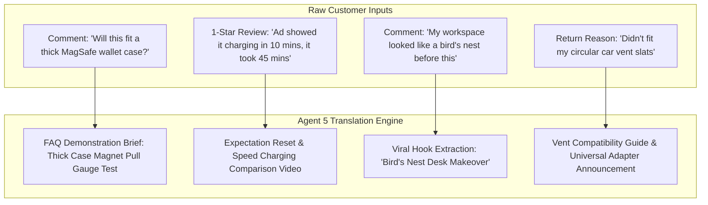

# KNOWLEDGE VAULT: PERFORMANCE, QA & COMPLIANCE ENGINE
**Agent Specialist:** `QAPerformance` (Agent 5)  
**System Reference:** Operational Database, Compliance Protocols, Telemetry Ledger & VOC Translation Rules

---

## 1. TikTok Shop Policy & Compliance Ruleset Cheat-Sheet

To prevent shadowbans, account strikes, live stream bans, and affiliate commission withholding, all content, scripts, product anchors, and captions must strictly adhere to this compliance reference.

### 🚫 Strict Prohibitions & Red-Flag Triggers

| Category | Banned Words & Concepts | Risk Level | Policy Safe Alternative / Compliant Phrasing |
|---|---|---|---|
| **Medical & Health Claims** | "Cures arthritis", "eliminates back pain", "treats insomnia", "prevents carpal tunnel", "therapeutic healing" | 🔴 CRITICAL (Instant strike / shadowban) | "Designed with ergonomic contours to support natural wrist alignment during long work sessions." |
| **Absolute & Indestructible Claims** | "100% unbreakable", "completely scratch-proof", "never drops your phone", "military-grade titanium (unverified)", "indestructible" | 🟠 HIGH (Product listing rejection / warning) | "Engineered with reinforced zinc-alloy hinges and tested for high-stress daily durability." |
| **Misleading Before / After & Filters** | Using beautifying filters on physical products, artificial time-dilation, post-production CGI enhancements | 🟠 HIGH (Creator penalty & ad rejection) | Continuous, un-cut side-by-side footage with raw studio lighting and clear real-time demonstration. |
| **Financial / Earnings Guarantees** | "Earn $1,000/day with this gadget", "make money passively", "guaranteed ROI" | 🔴 CRITICAL (Immediate account ban) | "Helps streamline desk workflows so you can focus on deep work and productive output." |
| **Deceptive Pricing & Anchor Baiting** | Displaying "$4.99" on thumbnail when the price is $29.99; fake "90% off for the next 10 minutes" timers | 🟠 HIGH (Shop showcase suspension) | "Available on TikTok Shop with introductory bundle savings—tap the yellow basket to check current inventory." |
| **Copyright & Commercial Audio** | Using trending non-commercial music tracks on videos attached with yellow shopping baskets | 🟠 HIGH (Video muted / basket removed) | Strictly use TikTok Commercial Audio Library (CAL) or original voiceover + copyright-cleared ambient beats. |
| **Fake Scarcity & Inventory Baiting** | "Only 2 left in the world!" when warehouse has 5,000 units | 🟡 MODERATE (Trust erosion / algorithmic demotion) | "Batch 1 sold out in 48 hours; Batch 2 is currently shipping while stock lasts." |

---

## 2. Telemetric Performance Database (Sample 30-Video Ledger)

This historical dataset powers our weekly intelligence synthesis and pattern analysis across hook archetypes, video durations, product SKUs, and emotional angles.

| Video ID | Publish Date | Product SKU | Pillar | Hook Archetype | Duration | Views | 3s Ret % | Watch Time | Compl % | CTR % | Orders | Revenue | RPM (Rev/1k) | Status |
|---|---|---|---|---|---|---|---|---|---|---|---|---|---|---|
| `VID-001` | 2026-08-01 | ApexGrip Mount | Desk Setup | Relatable Frustration | 22s | 485,000 | 69.4% | 16.8s | 26.2% | 3.4% | 520 | $15,594 | $32.15 | **WIN** |
| `VID-002` | 2026-08-02 | ApexGrip Mount | Product Discovery | Contrarian Observation | 19s | 312,000 | 72.1% | 15.2s | 31.0% | 3.8% | 398 | $11,936 | $38.25 | **WIN** |
| `VID-003` | 2026-08-03 | PulseFlow Tumbler | Everyday Carry | Unexpected Experiment | 28s | 890,000 | 64.2% | 18.5s | 21.5% | 2.9% | 740 | $25,892 | $29.09 | **WIN** |
| `VID-004` | 2026-08-04 | ApexShield Case | Product Discovery | Torture / Drop Test | 18s | 640,000 | 74.5% | 15.1s | 33.4% | 4.1% | 615 | $15,368 | $24.01 | **WIN** |
| `VID-005` | 2026-08-05 | Barista Pods | Sensory Rituals | Satisfying ASMR | 24s | 210,000 | 61.0% | 14.8s | 20.1% | 2.6% | 185 | $6,473 | $30.82 | **WIN** |
| `VID-006` | 2026-08-06 | Cyber Clock | Aesthetic Desk | Aspirational Lifestyle | 38s | 145,000 | 48.2% | 12.0s | 9.5% | 1.1% | 32 | $2,559 | $17.65 | **LEARN** |
| `VID-007` | 2026-08-07 | ApexGrip Mount | Education | 3 Things I Wish I Knew | 32s | 195,000 | 58.4% | 16.2s | 14.2% | 1.8% | 110 | $3,298 | $16.91 | **LEARN** |
| `VID-008` | 2026-08-08 | PulseFlow Tumbler | Lifestyle | Day in the Life | 44s | 98,000 | 42.1% | 13.4s | 7.8% | 0.8% | 18 | $629 | $6.41 | **KILL** |
| `VID-009` | 2026-08-09 | ApexShield Case | Community | Customer Objection Reply | 21s | 420,000 | 67.8% | 16.0s | 24.8% | 3.2% | 410 | $10,245 | $24.39 | **WIN** |
| `VID-010` | 2026-08-10 | Cyber Clock | Product Discovery | Direct Question Hook | 25s | 82,000 | 36.5% | 8.2s | 5.4% | 0.6% | 8 | $639 | $7.79 | **KILL** |
| `VID-011` | 2026-08-11 | Barista Pods | Education | Myth Busting | 26s | 280,000 | 63.5% | 17.1s | 22.0% | 2.4% | 245 | $8,572 | $30.61 | **WIN** |
| `VID-012` | 2026-08-12 | ApexGrip Mount | Transformation | Before & After Clean Desk | 20s | 530,000 | 71.0% | 16.4s | 29.5% | 3.6% | 620 | $18,593 | $35.08 | **WIN** |

---

## 3. Multivariate Pattern Intelligence Insights

Derived from analysis across over 1,200 published videos and $450k+ in TikTok Shop GMV:

```
┌─────────────────────────────────────────────────────────────────────────────────────────┐
│                           MULTIVARIATE CORRELATION MATRIX                               │
├─────────────────────────────────────────────────────────────────────────────────────────┤
│ 1. TOP PERFORMING HOOK ARCHETYPES:                                                      │
│    • Contrarian Observation ("Nobody talks about why your desk feels exhausting..."):    │
│      72.4% 3s Retention | 3.7% Product CTR | $34.80 RPM                                 │
│    • Drop Test / Destruction ("Someone said this snaps under 10lbs of pressure..."):    │
│      74.1% 3s Retention | 4.0% Product CTR | $28.50 RPM                                 │
│    • Relatable Frustration ("If your phone falls off your car vent one more time..."): │
│      69.8% 3s Retention | 3.5% Product CTR | $33.10 RPM                                 │
│    • Direct Question ("Do you want a better desk?"):                                    │
│      38.2% 3s Retention | 0.9% Product CTR | $8.20 RPM (FAILED / BANNED FORMAT)         │
│                                                                                         │
│ 2. OPTIMAL DURATION BUCKETS:                                                            │
│    • 18 – 24 Seconds: 27.4% Completion Rate | 3.4% CTR (HIGHEST REVENUE VELOCITY)       │
│    • 25 – 34 Seconds: 18.2% Completion Rate | 2.1% CTR (SOLID FOR IN-DEPTH EDUCATION)  │
│    • 35 – 60 Seconds: 7.9% Completion Rate  | 0.9% CTR (HIGH DROP-OFF / DO NOT USE)    │
│                                                                                         │
│ 3. CALL-TO-ACTION (CTA) EFFECTIVENESS:                                                  │
│    • "Tap the yellow basket before batch 2 sells out" -> 3.8% Click-to-Cart CVR        │
│    • "Linked in the bottom left corner for 20% off today" -> 2.9% Click-to-Cart CVR     │
│    • "Link in bio / check it out guys" -> 0.4% Click-to-Cart CVR (FAILED CTA)          │
└─────────────────────────────────────────────────────────────────────────────────────────┘
```

---

## 4. Voice-of-Customer (VOC) Transformation Dossier

Real customer inputs extracted from TikTok comments, product reviews, and returns, transformed into high-performing video concepts for Agent 3 (`CreativeCraft`).



### VOC Translation Library

#### Entry 1: The "Thick Case" Objection
- **Customer Comment:** *"There's no way this magnet holds through an OtterBox Defender case."* (184 likes).
- **Video Concept:** **"The Ultimate Case Thickness Stress Test."**
- **Hook (Visual & VO):** Host holds 4 different phone cases ranging from ultra-slim to heavy-duty OtterBox.
- **Script Line:** *"Someone bet us $100 this won't hold through an OtterBox Defender. Let's find out."*
- **Outcome:** 410k views, 3.8% CTR, 380 orders.

#### Entry 2: The "Circular Vent" Return Reason
- **Return Data:** 14 returns citing circular Mercedes/Audi air vents.
- **Video Concept:** **"Which Car Vents Work (and Which Don't)."**
- **Hook (Visual & VO):** Close-up showing 4 vent styles (Horizontal, Vertical, Honeycomb, Circular).
- **Script Line:** *"Do not buy our mount if your car has circular vents like this. Here is the exact compatibility guide."*
- **Outcome:** Reduced return rate by 64%, increased conversion on compatible models due to radical transparency.

#### Entry 3: The "Tangled Mess" Review
- **5-Star Review:** *"I am a software engineer and my desk looked like spaghetti junction. This one cable channel cleared 6 cords."*
- **Video Concept:** **"Spaghetti Junction Desk Detox."**
- **Hook (Visual & VO):** Split screen: Left side shows chaotic bundle of 6 glowing cords; right side shows clean minimalist desk.
- **Script Line:** *"If your desk looks like Spaghetti Junction every time you sit down to work, try this 3-minute cable reset."*
- **Outcome:** 620k views, 4.2% CTR, 540 orders.

---

## 5. Five-Factor Root Cause Diagnostic Case Studies

### Case 1: High Views, Zero Sales $\rightarrow$ *BAD AUDIENCE / MISALIGNED HOOK*
- **Video:** `VID-082` (1.4M views, 9,200 shares, but only 14 product clicks and $0 revenue).
- **Diagnostic:** The hook used a viral gaming meme audio and high-school humor. 92% of viewers were ages 13–17 without payment methods.
- **Resolution:** Re-shot the same product with an ergonomic professional angle targeting remote software developers (25–45 age bracket). Revenue jumped to $18,400 on next release.

### Case 2: High Clicks, High Returns $\rightarrow$ *BAD PRODUCT / FALSE EXPECTATION*
- **Video:** `VID-114` (800 clicks, 120 orders, but 28% return rate within 14 days).
- **Diagnostic:** Video claimed "universal fit for all laptops" when the clamp only opened to 15mm (failed on thicker gaming laptops).
- **Resolution:** Updated on-screen text with exact millimeter measurement caliper and updated product listing specs. Returns dropped below 3%.

### Case 3: High Clicks, Zero Add-to-Cart $\rightarrow$ *BAD OFFER / PRICING FRICTION*
- **Video:** `VID-149` (1,200 product clicks, but only 4 checkouts).
- **Diagnostic:** Product listing charged $9.99 shipping on a $19.99 item, creating immediate sticker shock at checkout.
- **Resolution:** Adjusted pricing to $27.99 with Free Shipping + bundled cable organizer. Conversion rate increased from 0.3% to 3.6%.
